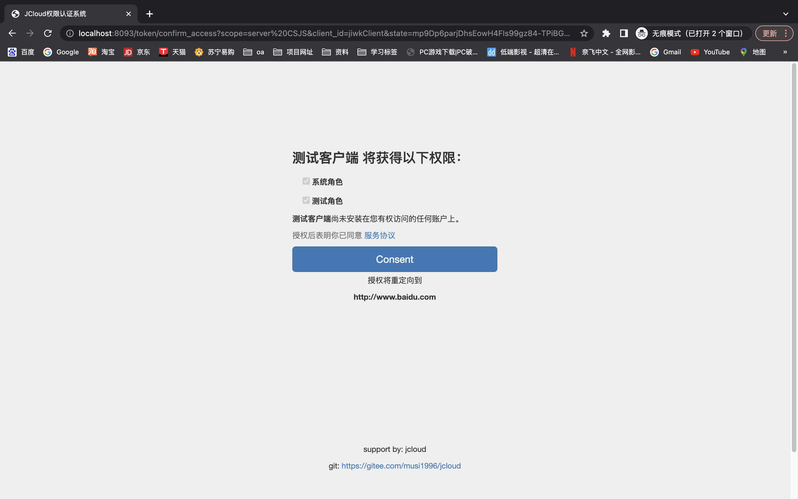

# JCloud权限认证中心
- 授权服务中心，提供了授权码模式，客户端模式，密码模式，手机号模式，邮箱模式多种认证方式
- 允许第三方接入权限体系
- 内部服务允许免鉴权
- 精确到接口级别的后端鉴权 
- 允许自定义多用户体系鉴权
## 使用
配置nacos注册地址，nacos提供对应的配置文件，参考nacos_config.sql
### 1.授权码模式
#### 1.1 访问 http://localhost:8093/oauth2/authorize?scope=server&client_id=jiwkClient&client_secret=Awert159&response_type=code&redirect_uri=http://www.baidu.com
由于没有登录，会跳转到登录页面

#### 1.2 登录成功跳转到确认授权页面

#### 1.3 授权成功会跳转到指定url并携带code

#### 1.4 根据code去申请token，此时Header需要携带客户端信息（Authorization：Basic base64(clientId:clientPassword)）

#### 1.5 此时Header便可携带token去访问资源服务器的资源接口了，Header需要携带客户端信息（Authorization：token）
### 2.密码模式
#### 直接发起Post请求访问http://127.0.0.1:8093/oauth2/token
#### 参数中指定申请类型和申请的权限范围并携带自己的认证信息
#### Header需要携带客户端信息（Authorization：Basic base64(clientId:clientPassword)）

其他模式参考 [接口文档](https://www.apifox.cn/apidoc/shared-78d892d2-13a5-439d-a82f-842a5d1cb2ca)