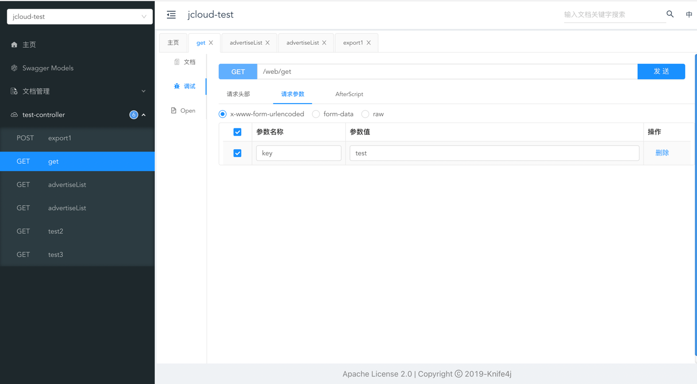

# common-knife4j
- 内部依赖了knife4j，对swagger的封装

## 依赖引用
### maven
```xml
<dependency>
  <groupId>com.jwk</groupId>
  <artifactId>jwk-common-knife4j</artifactId>
  <version>${version}</version>
</dependency>
```

## 使用文档

### 配置文件
```java
@ConfigurationProperties(prefix = "jwk.swagger")
@Data
public class JwkSwaggerProperties {

	/**
	 * 应用名
	 */
	private String title;

	/**
	 * 详情介绍
	 */
	private String description;

	/**
	 * 版本
	 */
	private String version = "1.0";

	/**
	 * 群组名
	 */
	private String groupName;

	/**
	 * 接口基础路径
	 */
	private String basePackage = "com.jwk";

}

```
### 开箱即用
直接访问服务的 /doc.html 路径
