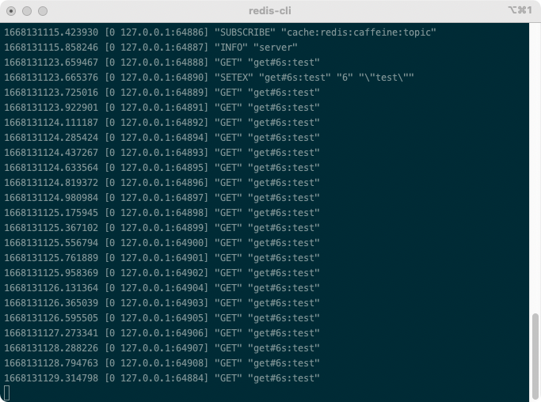
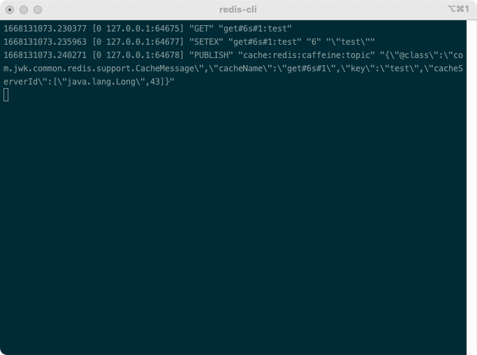

# common-redis
- redis cache 增强，支持 自定义符号（默认#）分隔 cachename 、 超时时间和是否使用多级缓存，支持 ms（毫秒），s（秒默认），m（分），h（小时），d（天）等单位。
- 基于 redis 的分布式限流组件。
-  提供 注解和方法 形式的分布式锁组件，支持spel表达式动态获取lockKey，简化加锁逻辑

## 依赖引用
### maven
```xml
<dependency>
  <groupId>com.jwk</groupId>
  <artifactId>jwk-common-redis</artifactId>
  <version>${version}</version>
</dependency>
```

## 使用文档

### 1. redis cache 增强
- 支持 # 号分隔 cachename 和 超时，支持 ms（毫秒），s（秒默认），m（分），h（小时），d（天）等单位。
- 支持Caffeine作为一级缓存，提高缓存性能
#### 1.1 开启增强的redis cache
```java
@EnableJwkCaching
```

#### 示例： 不使用caffeine一级缓存
```java
@Cacheable(value = "get#6m",key = "#key")
@GetMapping("/get")
public String get(String key){
    return key;
    }
```
##### 每次都会去访问redis

#### 示例：使用caffeine一级缓存
```java
@Cacheable(value = "get#6m#1",key = "#key")
@GetMapping("/get")
public String get(String key){
return key;
}
```
##### 只会访问一次


### 2. 分布式限流
#### 2.1 开启限流组件
```yaml
jwk:
  rate-limiter:
    redis:
      enable: true
```

### 2.2 使用注解
```java
@JwkRateLimiter
```

注解变量：
```java
/**
 * 限流的 key 支持，必须：请保持唯一性
 *
 * @return key
 */
String value();

/**
 * 限流的参数，可选，支持 spring el # 读取方法参数和 @ 读取 spring bean
 *
 * @return param
 */
String param() default "";

/**
 * 支持的最大请求，默认: 100
 *
 * @return 请求数
 */
long max() default 100L;

/**
 * 持续时间，默认: 3600
 *
 * @return 持续时间
 */
long ttl() default 3600L;

/**
 * 时间单位，默认为秒
 *
 * @return TimeUnit
 */
TimeUnit timeUnit() default TimeUnit.SECONDS;
```

#### 2.3 使用 Client
```java
@Autowired
private RateLimiterClient rateLimiterClient;
```

方法：

```java
/**
 * 服务是否被限流
 *
 * @param key 自定义的key，请保证唯一
 * @param max 支持的最大请求
 * @param ttl 时间,单位默认为秒（seconds）
 * @return 是否允许
 */
boolean isAllowed(String key, long max, long ttl);

/**
 * 服务是否被限流
 *
 * @param key      自定义的key，请保证唯一
 * @param max      支持的最大请求
 * @param ttl      时间
 * @param timeUnit 时间单位
 * @return 是否允许
 */
boolean isAllowed(String key, long max, long ttl, TimeUnit timeUnit);

/**
 * 服务限流，被限制时抛出 RateLimiterException 异常，需要自行处理异常
 *
 * @param key      自定义的key，请保证唯一
 * @param max      支持的最大请求
 * @param ttl      时间
 * @param supplier Supplier 函数式
 * @return 函数执行结果
 */
<T> T allow(String key, long max, long ttl, CheckedSupplier<T> supplier);

/**
 * 服务限流，被限制时抛出 RateLimiterException 异常，需要自行处理异常
 *
 * @param key      自定义的key，请保证唯一
 * @param max      支持的最大请求
 * @param ttl      时间
 * @param supplier Supplier 函数式
 * @return 函数执行结果
 */
<T> T allow(String key, long max, long ttl, TimeUnit timeUnit, CheckedSupplier<T> supplier);
```

### 3. 示例 redis key 超时事件（监听）

```java
@Async
@EventListener(RedisKeyExpiredEvent.class)
public void redisKeyExpiredEvent(RedisKeyExpiredEvent<Object> event) {
    String redisKey = new String(event.getId());
    System.out.println(redisKey);
}
```

### 4. 示例 redis 分布式锁
#### 4.1 注解形式
```java
@JwkRedisLock(key = "new com.jwk.common.idgenerater.manager.impl.RedisGeneratorManage().getIdLockKey(#slotId)")
public long generate(int slotId) throws Throwable {
    List<Long> ids = genIds(slotId, 1);
    return !ids.isEmpty() ? ids.get(0) : -1;
}
```
#### 4.2 方法形式
```java
@Autowired
private RedisLockService redisLockService;

public long generate(int slotId) throws Throwable {
    List<Long> ids = redisLockService.executeWithLock(getIdLockKey(slotId),()-> genIds(slotId, 1));
    return !ids.isEmpty() ? ids.get(0) : -1;
}

```
